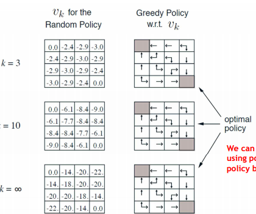

# 심층강화학습
이 문서는 [Notion](https://fuchsia-hole-cef.notion.site/97c67a1f4617446b83caba4d6cb3bd97)에서 Export한 md 파일입니다.

# Symbols

$S$ : set of States; 상태의 집합

$P_{tran}$ : state transition Probability; 다른 상태로 넘어갈 확률.

$R$ : Reward function; 보상 함수

$\gamma$ : Discounting factor; 미래의 가치를 현재로 환산할 때의 할인율.

$A$ : set of Action ; 행동의 집합.

$V(s)$ : State - value function; state 의 가치를 계산하는 함수

$Q_\pi(s,a)$: Action - value function; state에서 Action의 가치를 계산하는 함수.

$V^*(s) = \underset{\pi}{\max}V\pi(s)$ : optimal state value function; 상태의 기댓값을 최대로.

$Q^*(s,a) = \underset{\pi}{\max}Q_\pi(s,a)$: optimal action value function; 액션의 기댓값을 최대로

$\pi^*(a|s)$ : Optimal policy;  최대값을 가지는 Action Value function 을 선택하는 policy

$N(s)$ : state s에 방문한 횟수.

## Bellman Equation

$$V^*(s) = \underset{a}{\max}Q^*(s,a)
\\
Q^*(s,a)= R^a_s + \gamma \underset{s' \in S}\sum  P^a_{ss'},V^*(s')
\\
V^*(s) = \underset{a}{max}(R^a_s + \gamma \underset{s' \in S}{\sum} P^a_{ss'},V^*(S') \\
Q^*(s,a) = R^a_s + \gamma \underset{s' \in S}{\sum}P^a_{ss'},(\underset{a}{max}Q^*(s',a'))$$

## Dynamic Programming

Planning: Model-base(Env를 알때) Optimal한 value와 policy를 찾는 문제

Prediction: 

- MDP와 $\pi$가 주어지고
- $\pi$를 따랐을때의 value function을 계산하여 policy의 성능 측정

Control: 

- MDP 주어짐.
- optimal한 value function과 optimal policy를 구함.

## Policy Iteration

반복적으로 State Value를 업데이트.

어느 순간 값이 수렴하게 됨.

Optimal Policy는 각 State에서 다음 state로 Greedy하게 진행하면 Optimal Policy가 나옴.

Random Policy → Optimal Policy (Evaluate → Improve → Evaluate) 반복.

## Value Iteration

State Value 업데이트, 업데이트를 통해 Optimal한 Policy가 나옴.

모든 액션을 수행 했을 때, max 값을 업데이트.

## Monte-Carlo(MC) Learning

- MC learns from complete episodes(Episodic)
    - Terminate state가 존재해야 함.
    - $V(S_t) = \mathbb{E} [G_t|S_t = s]$
    - $G_t = r_t + \gamma r_{t+1} + \gamma^2r_{t+2} + \cdots + \gamma ^{T-1}r_{T}$
- $V(s) = Z(s) / N(s)$
- Zero bias / high variance
    - 초기값에 영향을 많이 받지 않음.
    - 

### Non-stationary problems

환경이 계속해서 변할 때, $\alpha$를 작은 수로 설정하여 과거의 episode들은 영향력이 작아지는 효과가 있다. (forget old episodes)

$$V(S_t) \leftarrow V(S_t) + \alpha(G_t-V(S_t))$$

## Temporal-Difference (TD) Learning

- incomplete episodes.
- Update value with estimated return. 예측된 return을 통해 value를 업데이트.

$$V(S_t) \leftarrow V(S_t) + \alpha(r_{t+1}+\gamma V(S_{t+1})-V(S_t))
\\ \color{red}
\textbf{TD target: } r_{t+1}+\gamma V(S_{t+1})
\\ \color{blue}
\textbf{TD Error } \delta_t \textbf{ : } 
r_{t+1}+\gamma V(S_{t+1})-V(S_t)$$

- final outcome이 나오지 않아도 업데이트.
- some bias / low variance
    - 초기값에 영향을 많이 받음.